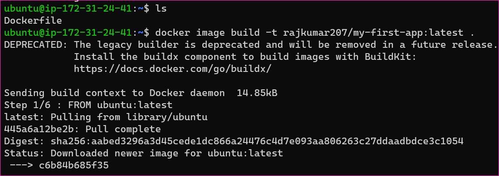
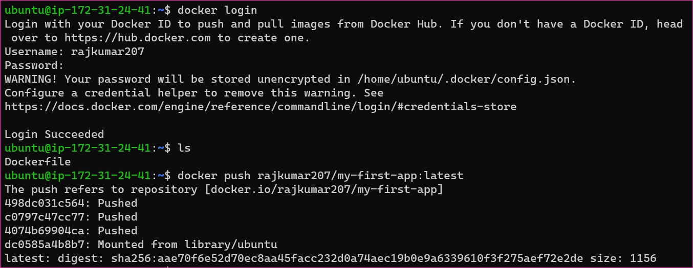

To Create basic hello-wolrd dockerfile and send a image to dockerhub
--------------------------------------------------------------------

* For the above image purpose to create a ubuntu ec2 instance


* After that login to the ec2 machine by using terminal


* To execute the below commands 
```
sudo apt update
sudo apt install docker.io -y
sudo usermod -aG docker ubuntu
exit
# relogin the ec2 instance
docker -v
sudo systemctl status docker
```


* To create image and using that image to create container and after that push the image to dockerhub
* To write simple Dockerfile
```Dockerfile
FROM ubuntu:latest
WORKDIR /app
COPY . /app
RUN apt-get update && apt-get install -y python3 python3-pip
ENV NAME World
CMD ["python3","app.py"]
```
* For the above step we need to run the below commands
```
docker image build -t rajkumar207/my-first-app:latest .
docker images ls
docker container run -d -it rajkumar207/my-first-app:latest
docker container ls -al
docker login
# enter username
# enter password
docker push rajkumar207/my-first-app:latest
```




