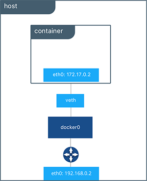
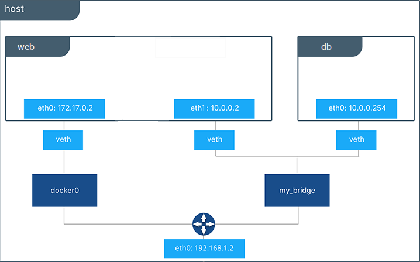

Docker Networking
-----------------
* Networking allows containers to communicate with each other and with the host system. 
* Containers run isolated from the host system and need a way to communicate with each other and with the host system.

* By default, Docker provides two network drivers for you, the bridge and the overlay drivers.

```
docker network ls
```

* Output
```
NETWORK ID          NAME                DRIVER
xxxxxxxxxxxx        none                null
xxxxxxxxxxxx        host                host
xxxxxxxxxxxx        bridge              bridge
```

### Bridge Networking
* The default network mode in Docker. 
* It creates a private network between the host and containers, allowing containers to communicate with each other and with the host system.


* If you want to secure your containers and isolate them from the default bridge network you can also create your own bridge network.
```
docker network create -d bridge my_bridge
```

* Now, if you list the docker networks, you will see a new network.
```
docker network ls

NETWORK ID          NAME                DRIVER
xxxxxxxxxxxx        bridge              bridge
xxxxxxxxxxxx        my_bridge           bridge
xxxxxxxxxxxx        none                null
xxxxxxxxxxxx        host                host
```

* This new network can be attached to the containers, when you run these containers.
```
docker run -d --net=my_bridge --name db training/postgres
```

* This way, you can run multiple containers on a single host platform where one container is attached to the default network and the other is attached to the my_bridge network.

* These containers are completely isolated with their private networks and cannot talk to each other.


* However, you can at any point of time, attach the first container to my_bridge network and enable communication
```
docker network connect my_bridge web
```


### Host Networking
* This mode allows containers to share the host system's network stack, providing direct access to the host system's network.

* To attach a host network to a Docker container, you can use the --network="host" option when running a docker run command. When you use this option, the container has access to the host's network stack, and shares the host's network namespace. 
* This means that the container will use the same IP address and network configuration as the host.

* Here's an example of how to run a Docker container with the host network:
```
docker run --network="host" <image_name> <command>
```

* Keep in mind that when you use the host network, the container is less isolated from the host system, and has access to all of the host's network resources. 
* This can be a security risk, so use the host network with caution.

* Additionally, not all Docker image and command combinations are compatible with the host network, so it's important to check the image documentation or run the image with the --network="bridge" option (the default network mode) first to see if there are any compatibility issues.

### Overlay Networking
* This mode enables communication between containers across multiple Docker host machines, allowing containers to be connected to a single network even when they are running on different hosts.

### Macvlan Networking
* This mode allows a container to appear on the network as a physical host rather than as a container.